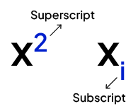

## **HTML介绍**

HTML全称是**Hypertext Markup Language**，即超文本标记语言，HTML之父是英国科学家**Tim-Berners Lee**。

**超文本**：区别于普通文本的线性阅读（即从上至下依次阅读）体验，超文本可以依靠超链接（*hyperlinks*）从当前文本跳转到另一个文本片段去。想象一下，当你拿到一本书，你开始翻阅目录并找到你感兴趣的章节，你决定去阅读该章节，于是你查看章节在书本中的页码后翻到页码处开始阅读。然而，超文本的能力就是，可以将目录中的章节名称与它实际对应的位置链接起来，并在你点击后一键跳转。

**标记语言**：标记语言意味着对一些文本进行标记后赋予其特殊意义，例如利用标记语言提供的相关语法，我可以对文本进行标题标记，这时这段文本就具有了标题含义。通过对标记语言标记的文本翻译渲染后，就会得到最终的文本内容。

因此，**HTML本质是一个标记语言**，是作用于超文本的标记语言。而利用HTML编写出来的文档，为HTML文件，后缀名是.**html**。HTML有什么用呢？我们为什么要编写HTML文档？这里引用[Codeguage](https://www.codeguage.com/courses/html/introduction)的话：

>Commonly, we say that HTML is used to define the ***content***, ***structure*** and ***meaning*** of webpages.
>***Content*** has to do with 'what' is shown on the webpage, ***structure*** has to do with 'how' that content is organized, whereas ***meaning*** has to do with what the content means (for e.g. some part of the content might mean a heading, some might mean a paragraph, and so on).

<br>

---

<br>

## **HTML学习资料**

隆重介绍我的初期学习资料：*Codeguage*。

Codeguage是一个线上网站，我特别喜欢它的标语：**“Become a fundamentally-sound web developer.”**。正如网站标语，Codeguage的创始者相关知识非常扎实，这可以从他写的教程中体现出来。网站包含web开发三件套：***HTML***、***Javascript***和***CSS***的英文教程，内容详尽专业堪比教材，网站页面舒适美观，部分章节甚至有练习题和理论题的作为章节课后练习。

Codeguage网址：[https://www.codeguage.com/courses/html/introduction](https://www.codeguage.com/courses/html/introduction)

<br>

---

<br>

## **HTML文档的生产流程**

学习Codeguage的第一个感受就是，其实学习的开始并不复杂。在我之前的学习中，我总是会对一门技术学习的开始感到恐惧：这个学习资料好吗？我怎么学最高效、学习路径应该怎么样？我是不是要下好多软件、进行好多配置，这肯定很麻烦吧？最重要的是，我该怎么开始？

在Codeguage的保姆级教程中，关于HTML的开始有一个小节去描述，将其化繁为简并专注于HTML本身，仅仅就是打开*Windows*编辑器就能开始HTML的学习。这也让我明白，任何技能学习的初期，工具是最不重要的一环，哪怕是学习C语言，也可以通过简单的Windows文档编辑器开始，甚至草稿本也可以。别让开始和选择磨灭学习的热情，学习像场探险不是吗，保持兴奋吧！

***Hey,bro.Just do it!***

所以一份HTML的文档诞生过程就是：打开一个文档编辑器 -> 编辑内容 -> 浏览呈现。

打开文档编辑器，这个过程最简单，随意选择一款文档编辑器，可以是最原始的草稿本，也可以利用电脑自带的文档编辑器编写，也可以选择一款最流行的大家都在使用的文档编辑器app，这无所谓。其中最重要最核心的就是编辑内容，需要学习HTML的语法，来呈现你想象中的或者设计的超文本。而在我看来，一份HTML文档是否优秀只取决于一个因素：**是否足够美观**。

<br>

---

<br>

## **HTML文档的结构和组成**

### **结构**
```html
<!DOCTYPE html> <!-- 文档声明。DOCTYPE为文档声明关键词，html声明文档采用HTML5编写 -->
<html> <!-- 根元素。对html文档所有内容进行封装 -->
    <head>  <!-- 包含html文档元数据（meta information） -->
    
    </head>
    <body>  <!-- 包含html文档实际内容 -->

    </body>
</html>
```

### **组成**

HTML由元素（*element*）组成，元素类型有两种：

1. ***container element***：容器元素，具有开始标签和结束标签（*tag*），里面能够容纳内容。

2. ***void element***：非容器元素，只具有开始标签**无结束标签**，不可容纳内容。

而标签（*tag*），意味着一个元素。开始标签形如：< >，结束标签形如</ >。

标签可以通过添加属性（*attribution*）来改变默认行为，或添加特征。属性形如：name="value"。其中name是属性名，value是属性值，注意属性值需要用双引号引用。当需要为标签添加属性时，将其添加至**开始标签**内。

<br>

---

<br>

## **HTML的代码习惯**

1. 标签名小写。

2. 良好的缩进:元素间的嵌套逻辑结构注意使用**缩进**。

    ```html
    <html>
        <head></head>
        <body></body>
    </html>
    ```

3. 标签属性名和属性值间无空格，且属性值用双引号括起来

    ```
    name="value" -> yes
    name = "value" -> no
    name= "value" -> no
    ```

4. 使用标签时，确保你的使用目的和标签含义一致。

<br>

---

<br>

## **HTML中的文本**

当我们使用HTML来编写文本内容时，我们可以利用HTML提供的元素来匹配我们文本内容，例如文本标题、文本段落、文本序列等。而且不同的元素在最终渲染后，会有一定的视觉效果，例如表示标题的元素，会是加粗黑色的大号字体，并与上下文有更多的行距。这在一定程度上轻松了作者的排版。

但值得注意的是，在使用相关元素时应当使**元素本身含义对应文本内容含义**。有时人们会为了某些元素的视觉效果而使用元素，这完全背离了元素本身所对应的含义，也背离了HTML的理念，也给后续的使用中埋下诸多隐患。

与HTML文本相关的元素有：

1. **\<h>**

2. **\<p>**

3. **\<ol>、\<ul>、\<li>**

<br>

### **\<h> - 标题**

1. 含义：容器元素。表示一个**标题**。

2. 渲染：共有六个等级：\<h1>、\<h2>、\<h2>、\<h3>、\<h4>、\<h5>、\<h6>，不同等级标题的大小不一样。

3. 注意：**每个网页应该只包含一个一级标题\<h1>**。

4. 使用：
    ```html
    <h2>Heading 2</h2>
    ```

<br>

### **\<p> - 段落**

1. 含义：容器元素。表示一个**段落**。

2. 渲染：一个段落有更多的上下文空白空间（段落间距）。

3. 使用：
    ```html
    <p>This is a paragraph</p>
    ```
<br>

### **\<ol>、\<ul>与\<li> - 列表**

1. 含义：容器元素。\<ol>（*ordered list*）用来表示有序列表，\<ul>（*unordered list*）用来表示无序列表，而列表元素则使用\<li>表示。

2. 一般使用：
    
    ```html
    <ol>
        <li>C</li>
        <li>Java</li>
        <li>C++</li>
    </ol>
    ```

    ```html
    <ul>
        <li>C</li>
        <li>C++</li>
        <li>Java</li>
    </ul>
    ```
3. 嵌套使用：
    列表可以嵌套使用，编写嵌套列表时，最好从外往里写，而不是从上到下依次写。

    ```html
    <ol>
        <li> <!-- 一级元素 -->
            <p>Best language</p>
            <ul>
                <li>C</li> <!-- 二级元素 -->
                <li>C++</li>
                <li>Python</li>
                <li>Java</li>
            </ul>
        </li>
        <li> <!-- 一级元素 -->
            <p>Best tutorial</p>
            <ul>
                <li>GeeksforGeeks</li> <!-- 二级元素 -->
                <li>Codeguage</li>
            </ul>
        </li>
    </ol>
    ```

4. 注意：

    - \<ul>和\<ol>里面**直接**包含的元素应当只有\<li>
        ```html
        <!-- bad -->
        <ol>
            <p>bad bad bad</p>
            <li>bad</li>
            <li>use</li>
        </ol>

        <!-- good -->
        <ul>
            <li>
                <p>good good good</p>
            <li>
            <li>good</li>
            <li>use</li>
        </ul>
        ```
    - \<li>只能用于元素\<ol>和\<ul>里面。
<br>

---

<br>

## **HTML中的文本渲染**

我们可以利用HTML的一些元素对文本内容进行渲染，例如文本加粗、文本斜体等等。

和文本渲染相关的元素有：

1. **\<strong>、\<b>**

2. **\<em>、\<i>**

3. **\<pre>**

4. **\<mrak>**

5. **\<s>**

<br>

### **\<strong>和\<b> - 加粗**

1. 含义：都为容器元素。都表示将内容加粗。

2. 渲染：被元素包含的内容被加粗。

3. 区别：在语义强调上有区别。\<strong>表示在内容在**语义上**进行强调加粗，表示这段内容可能有非常重要的信息。而\<b>仅仅只是将内容在**视觉上**加粗。

4. 使用：

    ```html
    <strong>This content will be bold</strong>
    <b>This content will be bold too</b>
    ```

<br>

### **\<em>和\<i> - 斜体**

1. 含义：容器元素。都表示将内容斜体。

2. 渲染：被元素包含的内容被斜体。

3. 区别：
    - 在语义强调上有区别。\<em>表示内容强调，而\<i>仅仅只是斜体。
    - 引申使用上有区别。\<i>由于首字母和*icon*（图标）一致，因此被图标库用来表示某个图标。

4. 使用：

    ```html
    <em>This content will be italicize</em>
    <i>This content will be italicize too</i>
    ```

<br>

### **\<pre> - 保留空格**

1. 含义：容器元素。\<pre>（*preserve*）用于保留元素中的空白空间（*whitespace*）。因为处理很多元素中的连续空白空间时会将其处理为一个空格，如果的确需要保留这些空间，可以使用\<pre>。

2. 渲染：文本字体变为**等距字体**。

3. 使用：

    ```html
    <pre>Here has some   space   !</pre>

    <!-- output:Here has some   space   !-->
    ```

<br>

### **\<mark> - 高亮**

1. 含义：容器元素。表示将文本高亮。

2. 使用：

    ```html
    <p>Do you know who i am? I'm <mark>Iron Man</mark>!</p>
    ```

<br>

### **\<s> - 穿刺**

1. 含义：容器元素。表示将文本使用穿刺线。

2. 渲染：看起来像将文本加了条划线。

3. 使用：最常用的地方，它最有价值的地方，就是在超市打折的时候，将原价划掉！

    ```html
    <p><s>shit</s>,<s>fuck</s>...oh i'm sorry,i should'n use word like this!</p>
    ```

<br>

---

<br>

## **HTML中的链接及引用**

HTML不是普通的文本标记语言，而是超文本标记语言，其中超字意味着超链接。

这意味着HTML可以在文本中引入链接，并可以通过链接跳转到链接指向的网页。互联网上的网页中包含上亿个链接，这些链接将网页链接指向另一个网页，这也是互联网的“网”的含义。

链接不仅可以指向另一个网页，也可以直接指向网络资源，如图片、pdf等等。这些网页中指向互联网上资源的链接为**hyperlink**。互联网的资源地址为**URI**，全称为*Uniform Resource Identifier*。URI有两类：

1. **URLs**：Uniform Resource Locators，用来**定位和访问**互联网上的资源。

2. **URNs**：Uniform Resource Names，用来**标识**资源，不能直接访问。URNs的意义在于持久地标识资源，即使资源的物理位置发送变化URNs也保持不变。可以通过解析URN得到资源当前的URL，从而对资源进行访问。

URI的构成语法为：`scheme:[//authority]path[?query][#fragment]`。

1. **scheme**：指明了资源的本质，如http资源、email资源、telephone资源等。常见的scheme有http、https、mailto、tel、telnet、file、ssh、irc等等。

2. **authority**：标明了资源的实体，语法构成为`[userinfo@]host[:port]`。例如对于http资源，authority是一个域名（*domain name*）。

3. **path**：指定了实体中资源的路径，可以是物理路径或者抽象路径。

4. **query**：向资源传递一条附加信息。

5. **fragment**：指明资源中的一个特定部分。

一个可以获得特定资源的URL为**完整URL**，存在两种不同的方式得到完整的URL：

1. **absolute URL**：开始于scheme，并且包含所有定义完整URL的必须信息。

2. **relative URL**：也称相对参考（*relative reference*），包含定义完整URL的部分信息，不以scheme开始，需要和一个absolute URL组合得到完整URL。组合得到的完整URL为**target URL**，被组合的absolute URL为**base URL**。以下是不同的relative URL：

    - 开始于//：为**network-path reference**。
    ```
    base URL: http://example.com/home.html
    relative URL: //codeguage.com/about
    target URL: http://codeguage.com/about
    ```

    - 开始于/：为**absolute-path reference**。
    ```
    base URL: http://example.com/items/watch.html
    relative URL: /home.html
    target URL: http://example.com/home.html
    ```

    - 无任何/：为**relative-path reference**。
    ```
    base URL: http://example.com/items/watch.html
    relative URL: cup.html
    target URL: http://example.com/items/cup.html
    ```

在HTML中与引入链接以及引用内容相关的元素有：

1. **\<a>**

2. **\<dfn>**

3. **\<abbr>**

4. **\<q>、\<blockquote>、\<cite>**

<br>

### **\<a> - 引用链接**

1. 含义

    容器元素。a（*anchor*）是锚点的意思，每个\<a>元素都是一个锚点。HTML共有两种锚点：

    - **资源锚点**（*source anchor*）：指向另一处资源的锚点为资源锚点。

    - **目的地锚点**（*destination anchor*）：被另一个锚点指向的锚点为目的地锚点。成为目的地锚点等价于**成为HTML文档的fragment**。

2. 渲染

    内容有下划线且不为黑色。点击内容可以跳转链接地。

3. 一般使用

    - 通过属性*href*给出URL成为资源锚点（可以是absolute URL，也可以是relative URL）
        ```html
        <!-- absolute URL --> 
        <a href="https://www.codeguage.com/>This is Codeguage.</a>

        <!-- relative URL -->
        <a href="gretting.txt">Open greeting.txt.</a>
        ```

    - 通过属性*name*成为目的地锚点
        ```html
        <p><a name="#achor">This is a destination anchor.</a></p>
        ```

4. 改变默认行为使用

    默认情况下，点击source anchor后，会在当前页面跳转至目的地资源处。如果要改变这个默认行为，例如变为在新的标签页中打开目的地链接等等，需要结合属性*target*。有以下几种target值：

    1. _blank：在新标签页打开网页。

    2. _self：在当前标签页打开网页。

    3. _parent

    4. _top

        ```html
        <p><a href="https://www.codeguage.com/ target="_blank">Open it</a></p>
        ```

<br>

### **\<dfn> - 术语名词**

1. 含义：容器元素。\<dfn>（*definition*）用来表示一个即将定义的术语。

2. 渲染：内容斜体。

3. 注意：别纯呼呼的将整个术语及其定义都包含，它只包含术语本身。

4. 使用：

    ```html
    <p><dfn>HTML</dfn> is a mark language that means hypertext mark language.</p>
    ```
        
<br>

### **\<abbr> - 缩写词**

1. 含义：容器元素。\<abbr>（*abbreviation*）用来表示缩写词。常用于在某个缩写词第一次出现时表示，并在其后添加上完整形式。

2. 正常使用：正常使用无渲染效果。

    ```html
    <p><abbr>HTML</abbr> (Hypertext Markup Language) is a very powerful tool to build webpage.</p>
    ```

2. 结合属性使用：如果使用它的*title*属性，使缩写短语下方出现连续**圆点下划线**，以及当鼠标停留时，会呈现*title*的值。

    ```html
    <p><abbr>HTML</abbr> (Hypertext Markup Language) is a very powerful tool to build webpage.</p>
    ```

<br>

### **\<q>、\<blockquote>、\<cite> - 引用内容**

1. 含义：容器元素。都表示**引用**。

2. \<q>（*quatation*）使用：表示引用内容，它需要在其他内容的行内使用，不能单独作为一行内容使用。

    ```html
    <!-- good use -->
    <p>毛主席说过：<q>世界是你们的，也是我们的，但是终究是你们的</q></p>。

    <!-- wrong use -->
    <p>毛主席也说过：</p>
    <q>不能在HTML这么使用q标签</q>
    ```

3. \<blockquote>可以单独作为一行内容使用。

    ```html
    <p>毛主席还说过：</p>
    <blockquote>
        这么用就对咧！
    </blockquote>
    ```

4. \<cite>则用于引用参考内容的内容标题，注意是参考的内容标题或者章标题，不是作者名。

    ```html
    <p>I love the part <q>Started out on a one way train</q> in the song <cite>Steal the show</cite> from the movie, <cite>Elemental</cite>.</p>
    <p>This example is from <cite>Codegauage:HTML(Advanced Text)</cite></p>
    ```

    以下内容是Codeguage的解释：

    >we refer to a portion of lyrics from a famous song while citing the name of the song.Notice that since the song is part of a movie, it makes perfect sense to cite the movie as well.

    在视觉呈现上，内容会斜体


<br>

---

<br>

## **HTML中的数学公式及代码**

<br>

### **\<sub>和\<sup> - 上下标**

1. 含义：容器元素。sub（*subscript*）表示下标，sup（*superscript*）表示上标。

2. 渲染：



3. 使用：

    ```html
    <p>11<sup>2</sup> = 121</p>
    ```

<br>

### **\<code>、\<samp>和\<kbd> - 代码**

1. 含义：容器元素。\<code>表示代码、\<samp>表示代码输出、\<kbd>表示键盘输入。

2. \<code>：内联元素。若需要跨行表示代码，需要使用\<pre>。

    ```html
    <p>Here's some JavaScript code:</p>

    <pre><code>var x = 10;
    console.log(x ** 2);</code></pre>
    ```

3. \<samp>：内联元素。若需要跨行表示代码输出，需要使用\<pre>。

    ```html
    <p>The code produces the following output:</p>

    <pre><samp>0 1 2
    -1</samp></pre>
    ```

4. \<kbd>：内联元素。

    ```html
    <p>To save a file, we use <kbd>Ctrl + S</kbd>.</p>
    ```

---

<br>

## **HTML中的图片**

<br>

---

<br>

## **HTML中的Metadata**

<br>

---

<br>

## **HTML中的网页含义**

<br>

---

<br>

## **HTML中的表格**

<br>

---

<br>

## **HTML中的输入**

<br>

<br>

### **\<br>**

1. 含义：非容器元素。表示换行。

2. 渲染：效果和编辑文档时添加了一个回车一致。

3. 为什么使用：
    对于除\<pre>外的元素内容**中间的**连续的空白空间（***whitespace***：空格、换行）渲染时，会替代为一个空格空间（开头的空白空间替代为零个空格）。例如：

    ```html
    <p>
        Hello
        ,
        World!
    </p>

    <!-- output：Hello , World!-->
    ```
    此时倘若想对某个段落内换行则需要使用到该元素。

4. 如何正确使用：
    连续\<br>可以让文本之间产生空白空间，而\<p>可以让文本之间同样产生空白空间。从文章视觉呈现上，使用\<br>和使用\<p>似乎都能达到分段的效果。然而事实并不如此，**HTML是文本标记语言而不是文本排版语言**，因此重要的是对文本进行标记，标记清楚什么是标题哪个是段落，哪个又是链接等等，而视觉呈现只是附加的属性。为了追求视觉呈现随意使用元素是很新手的行为。就内容和语义上来说，\<p>标记的应该是内容的某一段，而\<br>只是单纯因为此处需要换行。例如歌曲歌词是一整个完整的段落，然而每句歌词需要换行：

    ```html
    <h2>Love Stroy Short</h2>
    <p>
        wake up,light the blunt up,put out 'fore I fall asleep<br>
        Mt bitch look like she Cherokee,my crib look like I'm sellin' keys<br>
        My dick feel like some therapy,'bout that life I gurantee<br>
        ...
    </p>
    ```

<br>

### **\<div>和\<span>**

1. 含义：容器元素。\<div>表示一个没有任何含义的块，\<span>表示一个没有任何含义的行片段。

2. 块和行片段：元素可以分为块元素和内联（*inline*）元素。块元素开始一个新行，而内联元素与相邻内联元素一起出现在同一行。

